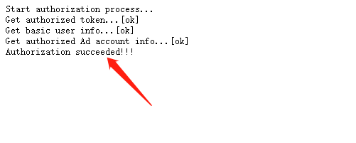

广告种子同步推广媒体功能操作指引
================================

对于 UPLTV
为您分析提供的广告种子用户数据（下称“广告种子”），您不仅可以选择以文件形式导出或通过
API
方式获取，还可以选择同步到指定的广告推广媒体，以便于直接用作定向用户推广执行的数据依据。
目前仅支持以 Facebook
推广账号作为同步目标，广告种子数据将以“广告受众”的形式同步到指定的
Facebook 推广账号中。

Facebook 推广账号授权
---------------------

首先，您需要将要作为同步目标的 Facebook 推广账号授权给 UPLTV。

首次使用本功能时，您会在功能操作栏中看到 “向 UPLTV 授权 Facebook
推广账号” 按钮，点击按钮开始进行授权。

点击弹出页面中的 “进入 Facebook 完成授权”
按钮，按照落地页面指引提醒确认提供授权即可。

**Step 1 - 确定登陆将要授权的账号，并点击继续按钮：**

.. figure:: ../img/01.jpg
   :scale: 70 %
   :alt: picture 1

**Step 2 - 请务必保证 “管理广告” 状态为 “是”，并点击完成按钮：**

**Step 3 - 最终步骤，点击确认按钮：**

.. figure:: ../img/03.jpg
   :scale: 70 %
   :alt: picture 3

**大功告成 - 最终提示 “Authorization succeeded” 即可：**

关于账号授权的一些说明
^^^^^^^^^^^^^^^^^^^^^^

授权成功后，UPLTV 将自动获取授权账号下允许访问的 Facebook
推广账号列表，并定期更新。因此如果您需要将数据同步到新的广告账号中，只要在
Facebook 后台设置这个新推广账号允许已授权用户账号访问即可。

您也可以更换授权账号，但该操作会导致已经创建的同步规则被全部移除，因此请谨慎操作！

一些特殊情况下，可能会出现授权 token 失效的情况。此时，您会在 UPLTV
后台看到明显的 “重新授权”
的提示和操作入口，请按照流程指引重新完成授权即可。

创建和维护同步规则
------------------

完成账号授权后，您就可以开始创建自定义的同步规则了。

您可以随意设置将任意多个产品提供的广告种子同步到任意多个 Facebook
广告账号中。

一些关于同步机制的说明
----------------------

#. 被同步的广告种子数据将按产品归入不同的“Facebook 广告受众”中，受众命名规则：**UART_[data]_[country]_[pid]_[type]_[accountID]**，其中：

    data：最新的同步更新日期，格式 yyyymmdd

    country：广告种子数据所属国家编码（ISO 3166-1），例如：US、JP

    pid：广告种子数据所属产品在 UPLTV 的产品编号

    type：广告种子数据产生的数据维度依据，包括 revenue 和 eCPM 两种类型

    accountID：Facebook广告账号ID

#. UPLTV 会每天按照广告种子数据的更新情况，对相应的“Facebook 广告受众”中用户数据进行更新，更新的方式为差异更新 —— 增加新补充的种子、移除已废弃的种子。

#. 系统同步更新时间为每天20点（北京时间），同步完成时间受实际任务队列先后影响，最多不超过30分钟。